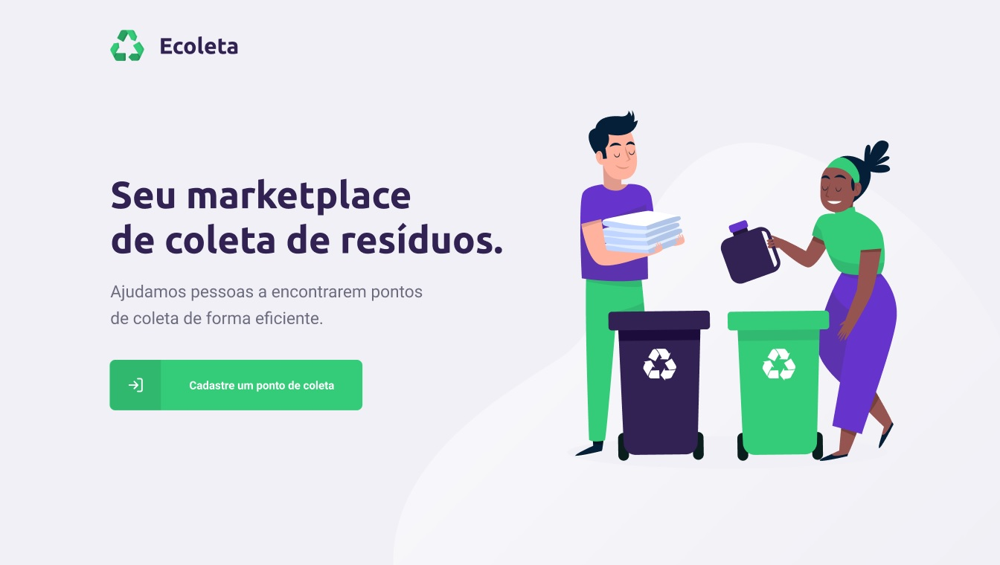

<h1 align="center" style="color: #322153">
    ♻️ Ecoleta
</h1>

<p align="center">
  

   <a href="https://github.com/brunoambr/ecoleta/commits/master">
    
  </a>

  

  

</p>

<div style="display: flex; flex-direction: column; align-items: center; justify-content: center;">
  <h2 style="color: #322153; margin-bottom: 30px">Seu marketplace de coleta de resíduos</h2>
  
</div>

<h3 style="color: #322153">Layout do projeto</h3>

Todo o layout do projeto encontra-se disponível no [Figma](https://www.figma.com/file/1SxgOMojOB2zYT0Mdk28lB/Ecoleta?node-id=0%3A1)!

<h3 style="color: #322153">Sobre</h3>

O projeto conta com uma plataforma web para cadastro de entidades que realizam a coleta dos seguintes tipos de resíduos:
- Lâmpadas
- Pilhas e baterias
- Papeis e papelão
- Resíduos eletrônicos
- Resíduos orgânicos
- Óleo de cozinha

No aplicativo móvel, os usuários podem buscar as entidades cadastradas e entrar em contato:
- Via e-mail
- Via Whatsapp

<h3 style="color: #322153">Tecnologias utilizadas</h3>

- Backend
  - [Typescript](https://www.typescriptlang.org/)
  - [Node.js](https://nodejs.org/)
  - [Express](https://expressjs.com/pt-br/)
  - [SQLite](https://www.sqlite.org/index.html)
  - [Knex.js](http://knexjs.org/)
  - [Multer](https://github.com/expressjs/multer)
  
- Frontend
  - [React](https://reactjs.org)
  - [React Native](https://github.com/facebook/react-native)
    - [Expo](https://expo.io/)


<h3 style="color: #322153">Como utilizar?</h3>

Este repositório está dividido em três diretórios:
- server (backend)
- web (frontend web)
- mobile (frontend mobile)

### Backend

```bash
$ npm run dev
```

### Frontend (web)

```bash
$ npm run start
```

### Frontend (mobile) 

```bash
$ npm run start
```

Agradecimento especial à [Rocketseat](https://rocketseat.com.br/) pelo aprendizado obtido durante a primeira Next Level Week, evento gratuito que ocorreu entre os dias 01/06/2020 e 07/06/2020.

🚀🚀